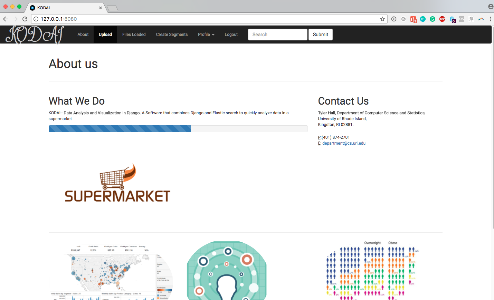
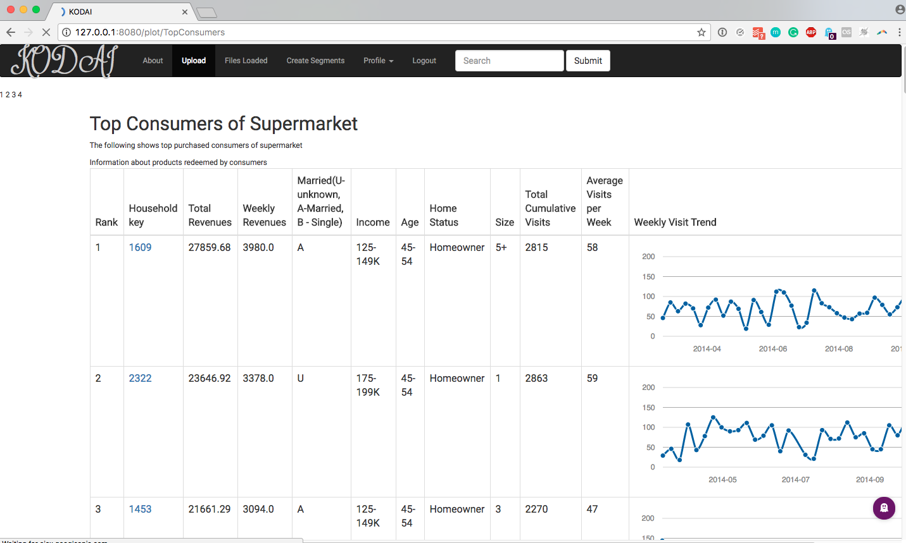

## Kodai: A Software Architecture and Implementation for Segmentation
----
####                                    by Rick Rejeleene

This software was written for my M.S dissertation in Computer Science.

URL: [Dissertation](digitalcommons.uri.edu/theses/1107/)

----

#### Screenshots:


Figure 1: Kodai - Web-application

----



Figure 2: Kodai -- Retrieving Top Consumers from dataset

----

#### Preface:

We build a web-application in Python to implement segmentation
and revenue increase hypothesis in supermarket data.

Our Dataset has information about product details, purchases, demographics, coupons. Using this, our goal is to improve revenues by targeting Segments in the Dataset.

We use dunnhumby's data for a Supermarket.

----

#### Abstract:

The purpose of this thesis is to design and implement a software architecture for segmentation models to improve revenues for a supermarket. This tool supports analysis of supermarket products and generates results to interpret consumer behavior, to give businesses deeper insights into targeted consumer markets. The software design developed is named as Kodai. Kodai is horizontally reusable and can be adapted across various industries. This software framework allows testing a hypothesis to address the problem of increasing revenues in supermarkets. Kodai has several advantages, such as analyzing and visualizing data, and as a result, businesses can make better decisions. In addition to these advantages, Kodai is open-source, which means any developer can access the code, and develop into client requirements. With the described features, it is better than other similar tools such as Gephi, a free visualization and manipulation tool.

This tool is developed to facilitate segmentation of consumer data based on purchase behavior with the goal of allowing the user to test a hypothesis to address the problem of increasing revenues in supermarkets. Most importantly, the software is reusable and can be adapted horizontally across various industries.

----

#### Data Set:

This dataset contains household level transactions over two years from a group of 2,500 households who are frequent shoppers at a retailer. It contains all of each household’s purchases, not just those from a limited number of categories. For certain households, demographic information as well as direct marketing contact history are included.

Below is the link for whole data-Set:

The Complete Journey

* [CSV-Files] https://www.dunnhumby.com/sourcefiles

* [YAML-FILES][1]

----

## DATA TABLES:
The following contains the structure of the Dataset, which we used for the whole prototype.

We use (a) to denote that a record is connected to another table.


----
##### CAMPAIGN\_TABLE
(1584 households mailed 30 Campaigns)

This table lists the campaigns received by each household in the study. Each household received a different set of campaigns.
File: campaign\_table.csv
```
HOUSEHOLD_KEY -- Uniquely identifies each household

(a)CAMPAIGN_TABLE -- Uniquely identifies each campaign. Ranges 1-30

DESCRIPTION -- Type of campaign(TypeA, TypeB or TypeC )
```

----
##### CAMPAIGN\_DESC
This table gives the length of time for which a campaign runs. So, any coupons received as part of a campaign are valid within the dates contained in this table.
(30 Campaigns)

*File: campaign\_desc.csv*
```
(a)CAMPAIGN -- Uniquely identifies each campaign. Ranges 1-30

DESCRIPTION -- Type of Campaign(TypeA, TypeB, TypeC)

START_DAY -- Start Date of Campaign

END_DAY -- End Date of Campaign
```

----
##### COUPON\_REDEMPT
(434 households redeemed 556 coupons from 30 Campaigns)

This table identifies the coupons that each household redeemed.

*File: coupon\_redempt.csv*


```
HOUSEHOLD_KEY -- Uniquely identifies each household

DAY -- Day when transaction occurred

COUPON_UPC -- Uniquely identifies each coupon

CAMPAIGN -- Uniquely identifies each campaign

```

----
##### COUPON
(1135 coupons promoted 44133 products for the 30 campaigns)

This table lists all the coupons sent to customers as a part of a campaign, as well as the products for which each coupon is redeemable. Some coupons are redeemable for multiple products. One example is a coupon for any private label frozen vegetable.

For campaign TypeA, this table provides pool of possible coupons. Each customer participating in a TypeA campaign received 16 coupons out of the pool. The 16 coupons were selected based on the customer's prior purchase behavior. Identifying the specific 16 coupons that each customer received is outside the scope.

*File: coupon.csv*

```
CAMPAIGN -- Uniquely identifies each campaign. Ranges 1-30

COUPON_UPC -- Uniquely identifies each coupon( unique to household and campaign)

PRODUCT_ID -- Uniquely identifies each product

```
----
##### HH\_DEMOGRAPHIC
(801 household)
This table contains demographic information for a portion of household.


*File: hh\_demographic.csv*
```
HOUSEHOLD_KEY -- Uniquely Identifies each household

AGE_DESC -- Estimated age range

MARITAL_STATUS_CODE -- Marital Status (A - Married, B- Single, U-Unknown)

INCOME_DESC -- Household income

HOMEOWNER_DESC -- Homeowner, renter

HH_COMP_DESC -- Household composition

HOUSEHOLD_SIZE_DESC -- Size of household up to 5+

KID_CATEGORY_DESC -- Number of children present up to 3+
```
----
##### TRANSACTION\_DATA.csv
(2500 Households shopped 92339 products)

This table contains all products purchased by household within this study. Each line found in this table is essentially the same line that would be found on a store receipt.

*File: transaction\_data2.csv*
```
HOUSEHOLD_KEY -- Uniquely identifies each household

BASKET_ID -- Uniquely identifies a purchase occasion

DAY -- Day when transaction occurred

PRODUCT_ID -- Uniquely identifies each product

QUANTITY -- Number of the products purchased during the trip

SALES_VALUE -- Amount of dollars retailer receives from sale

STORE_ID -- Identifies unique stores

COUPON_MATCH_DISC -- Discount applied due to retailer's match of manufacturer coupon

COUPON_DISC -- Discount applied due to manufacturer coupon

RETAIL_DISC -- Discount applied due to retailer's loyalty card program

TRANS_TIME -- Time of day when transaction occurred

WEEK_NO -- Week of transaction. Ranges 1 -102
```

----
##### PRODUCT.csv
(92353 products)

This table contains information on each product sold such as type of product, national or private label and a brand identifier.

*File:product.csv*

```
PRODUCT_ID -- Number that uniquely identifies each product

DEPARTMENT -- Groups similar products together

COMMODITY_DESC -- Groups similar products together at a lower level

SUB_COMMODITY_DESC -- Groups similar products together at a lowest level

MANUFACTURER -- Code that links products with same manufacturer together

BRAND -- Indicates Private or National label brand

CURR_SIZE_OF_PRODUCT -- Indicates package size
```

----

##### CASUAL\_DATA
(68377 products)

This table signifies whether a given product was featured in the weekly mailer or was part of an in-store display.

*File:causal\_data.csv*
```
PRODUCT_ID -- Uniquely identifies each product

STORE_ID -- identifies unique stores

WEEK_NO -- Week of the transaction

DISPLAY -- Display location

MAILER -- Mailer Location
```
----

## Release Notes
#### `v1.0.1`

## Contributors
[Rick][4]

[1]:	https://www.dropbox.com/sh/lz522q4z2119vh2/AACtNhemZOf4EtCojHccSHBBa?dl=0
[3]:	https://raw.githubusercontent.com/ludwigwittgenstein2/supermarket_elasticsearch/master/static/results-screenshot/Kodai.png
[4]:	https://github.com/ludwigwittgenstein2
